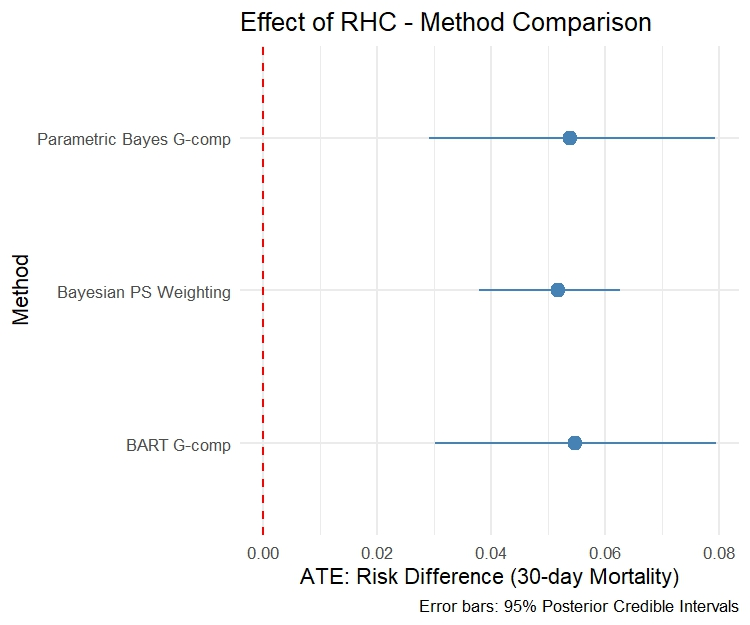
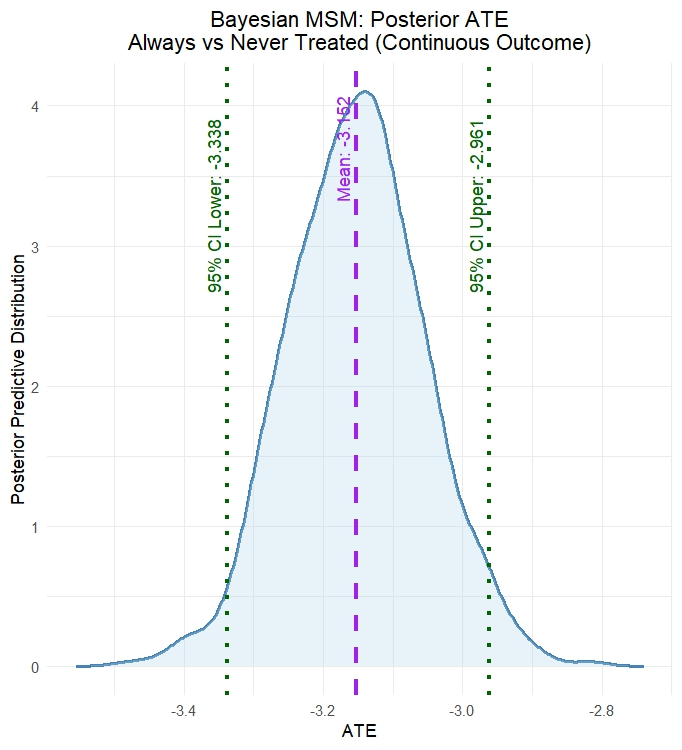
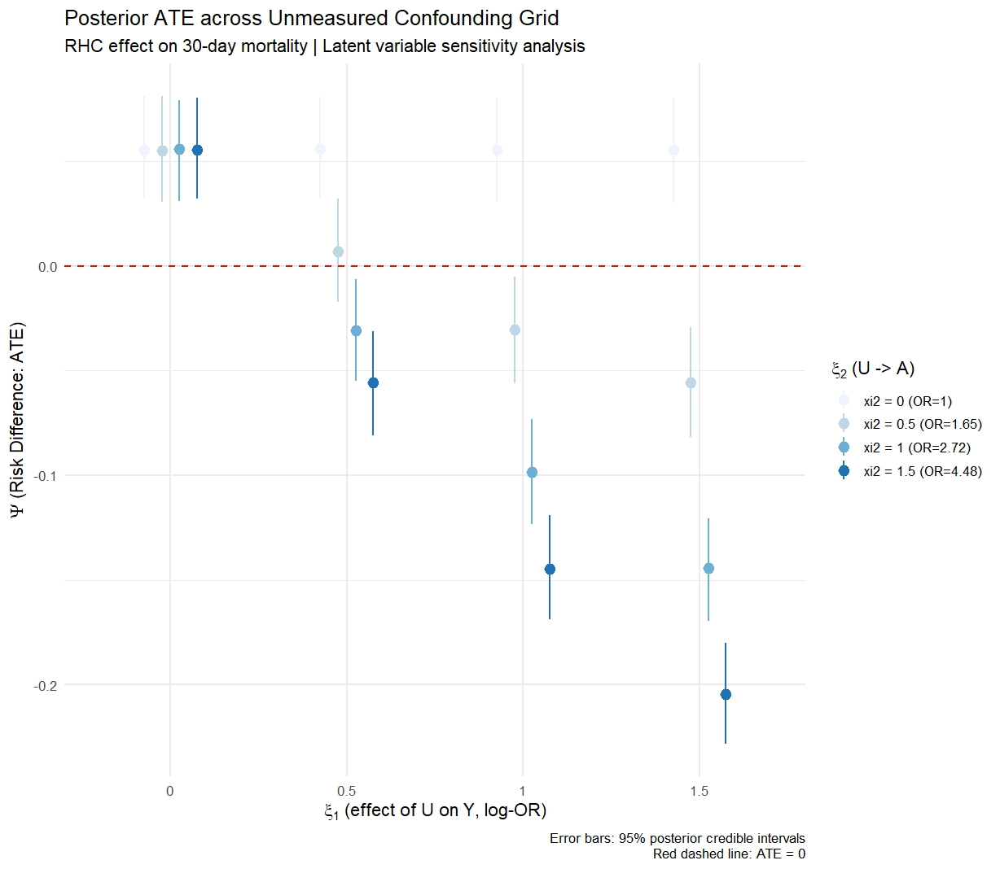
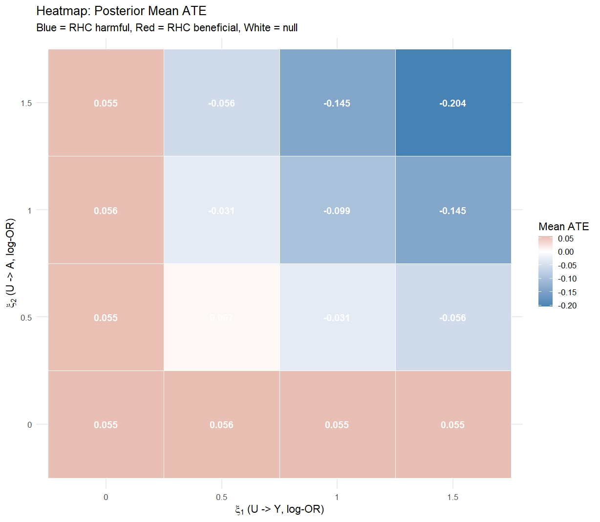

```{r include=FALSE}
library(knitr)
opts_chunk$set(echo = TRUE, eval = FALSE, warning = FALSE, message = FALSE)
```

## Workshop Outline

**Part I** &nbsp; Quick Introduction to Causal Inference

**Part II** &nbsp; Bayesian G-computation & Propensity Score Weighting

**Part III** &nbsp; Bayesian MSMs for Time-Varying Treatments

**Part IV** &nbsp; Bayesian Sensitivity Analysis for Unmeasured Confounding

**Part V** &nbsp; Causal Forests & CATE Estimation

::: {.callout-tip title="Pre-workshop setup"}
```r
install.packages(c("rstanarm","rstan","BART","bcf","bayesmsm","gtools"))
```
:::

::: {style="font-size:0.9em; margin-top:5em;"}
Full workshop materials: <https://github.com/Kuan-Liu/2026CSSC_BayesianCausal/>
:::

# Part I: Fundamentals of Causal Inference

## Why causal inference? {transition="slide"}

::: {.fragment .fade-in-then-semi-out}
- Healthcare providers and policy-makers make decisions based on **causal** knowledge - does this treatment actually work?
- Randomized controlled trials are the gold standard but not always feasible.
:::

::: {.fragment .fade-in-then-semi-out}
- **Observational studies** become invaluable, but treatment is not randomized.
- Patients who receive treatment may differ systematically - this is [confounding]{.alert}.
:::

::: {.fragment}
- [Statistical causal inference methods]{.alert} recover causal estimates from observational data by explicitly modelling the treatment assignment mechanism.
:::


## Potential outcomes {transition="slide"}

For subject $i$ with binary treatment $A_i \in \{0,1\}$, define [potential outcomes]{.alert}:

$$Y_i^1: \text{ outcome } \textit{had } \text{subject } i \text{ received } A=1$$
$$Y_i^0: \text{ outcome } \textit{had } \text{subject } i \text{ received } A=0$$

::: {.fragment}
We only ever observe **one** - the one matching the treatment actually received:
$$Y_i = A_i Y_i^1 + (1-A_i)Y_i^0$$
:::

::: {.fragment}
We target the [Average Treatment Effect (ATE)]{.alert}:
$$\Psi = E[Y^1 - Y^0] = E[Y^1] - E[Y^0]$$
:::

## Identification assumptions {transition="slide"}

::: {.callout-tip title="Four key identification assumptions"}
**IA.1 - Conditional Ignorability:**
$$Y^a \perp A \mid L, \quad a \in \{0,1\}$$
Measured covariates $L$ fully capture confounding between $A$ and $Y$.

**IA.2 - Consistency:** If $A_i = a$, then $Y_i = Y_i^a$. Treatment must be well-defined.

**IA.3 - No Interference (SUTVA):** Subject $i$'s outcome depends only on their own treatment.

**IA.4 - Positivity:** $0 < P(A=1 \mid L) < 1$ for all $L \in \mathcal{L}$.
:::

## From assumptions to estimation {transition="slide"}

Under IA.1--IA.4, the ATE is **identified** via [standardization]{.alert}:

$$\Psi = \int_\mathcal{L} \Big[ E[Y \mid A=1, L] - E[Y \mid A=0, L] \Big] \, dP(L)$$

::: {.fragment}
This expresses the unobservable causal contrast $E[Y^1] - E[Y^0]$ entirely in terms of the **observable** conditional outcome mean and the **observable** covariate distribution.

Computing this integral from data is called [g-computation]{.alert} or standardization.
:::

## Why Bayesian? {transition="slide"}

::: {.fragment}
**1. Full posterior inference for any estimand** 
A single MCMC run yields the full posterior distribution of $\Psi$ where we can report point estimates, credible intervals, and posterior probabilities $P(\Psi > 0 \mid \mathcal{D})$ all at once, for any transformation of model parameters.
:::

::: {.fragment}
**2. Principled regularization via priors**
Priors induce shrinkage in high-dimensional covariate models - a principled, probabilistic alternative to ad-hoc variable selection or penalization.
:::

::: {.fragment}
**3. Natural sensitivity analysis**
Untestable causal assumptions are encoded as priors on non-identifiable parameters. Uncertainty about assumption violations flows directly into the posterior of the causal estimand.
:::

## Data: Right Heart Catheterization {transition="slide"}

The **RHC dataset** (Connors et al., 1996) contains 5,735 critically ill ICU patients.

| Variable | Role | Description |
|----------|------|-------------|
| `swang1` | Treatment $A$ | RHC catheter on day 1 (Yes/No) |
| `death` | Outcome $Y$ | Death within 180 days (Yes/No) |
| `sadmdte`, `dschdte` | Dates | Admission, discharge (SAS integer) |
| `age`, `sex`, `race` | Confounders $L$ | Demographics |
| `meanbp1`, `hrt1`, ... | Confounders $L$ | Vital signs & labs |


## Data preparation {transition="slide"}

```{r eval=FALSE, echo=TRUE, message=FALSE, warning=FALSE}
library(tidyverse)
sas_origin <- as.Date("1960-01-01")

rhc <- read_csv("https://hbiostat.org/data/repo/rhc.csv") |>
  mutate(
    sadmdte = as.Date(sadmdte, origin = sas_origin),
    dschdte = as.Date(dschdte, origin = sas_origin),
    dthdte  = as.Date(dthdte,  origin = sas_origin),
    lstctdte = as.Date(lstctdte, origin = sas_origin),
    A       = as.integer(swang1 == "RHC"),
    Y_death = as.integer(death == "Yes"),
    Y_los   = as.numeric(coalesce(dschdte, lstctdte) - sadmdte)
  )

rhc |> count(A, swang1)
```

# Part II: Bayesian G-computation & PS Weighting

## The standardization estimand {transition="fade"}

Recall identification under IA.1--IA.4:
$$\Psi = \int_\mathcal{L} \Big[\mu(1,L) - \mu(0,L)\Big] \, dP(L)$$

where $\mu(a,L) = E[Y \mid A=a, L]$ is the **conditional outcome mean**.

::: {.fragment}

**Two modelling choices determine the estimator**  

1. How do we model $\mu(A, L)$? - **parametric** (e.g. logistic regression) or **nonparametric** (e.g. BART)   
2. How do we integrate over $P(L)$? - **empirical average** or **Bayesian bootstrap**
:::


## Bayesian parametric g-computation {transition="fade"}

**Step 1 - Specify a Bayesian outcome model:**
$$Y_i \mid A_i, L_i \sim \text{Bernoulli}\Big(\text{logit}^{-1}(\eta_0 + \eta_A A_i + L_i'\eta_L)\Big)$$
<!-- with priors $\eta \sim N(0, 2.5)$ - weakly informative, regularizing. -->

::: {.fragment}
**Step 2 - Obtain posterior draws via MCMC:**
$$\{\eta^{(m)}\}_{m=1}^M \sim p(\eta \mid \mathcal{D})$$
:::

::: {.fragment}
**Step 3 - For each draw, compute counterfactual predictions:**
$$\mu^{(m)}(1, L_i) = \text{logit}^{-1}(\hat\eta_0^{(m)} + \hat\eta_A^{(m)} + L_i'\hat\eta_L^{(m)})$$
$$\mu^{(m)}(0, L_i) = \text{logit}^{-1}(\hat\eta_0^{(m)} + L_i'\hat\eta_L^{(m)})$$
:::

## The Bayesian bootstrap {transition="fade"}

**Step 4 - Integrate over $P(L)$ using the Bayesian bootstrap:**

The empirical average $\frac{1}{n}\sum_i[\mu^{(m)}(1,L_i) - \mu^{(m)}(0,L_i)]$ treats $P(L)$ as **fixed and known** - propagating only outcome model uncertainty.

The **Bayesian bootstrap** (Rubin, 1981) places a proper posterior on $P(L)$:
$$p^{(m)} \sim \text{Dirichlet}(\mathbf{1}_n)$$

$$\Psi^{(m)} = \sum_{i=1}^n p_i^{(m)} \Big[\mu^{(m)}(1, L_i) - \mu^{(m)}(0, L_i)\Big]$$

::: {.fragment style="margin-top: -0.8em;"}
Each $m$ Dirichlet draw quantify joint [uncertainty over both model and covariate distribution]{.alert}.
:::

## Parametric g-comp: outcome model {transition="fade"}

```{.r code-line-numbers="|1-2|4-11"}
library(rstanarm)
library(gtools)

fit <- stan_glm(
  Y_death ~ A + age + sex + race + cat1 +
            meanbp1 + hrt1 + resp1 + temp1 + wtkilo1,
  data            = rhc,
  family          = binomial(link = "logit"),
  prior           = normal(0, 2.5),
  prior_intercept = normal(0, 5),
  chains = 4, iter = 2000, seed = 42)
```

::: {.fragment}
`stan_glm` fits a Bayesian logistic regression via MCMC using Stan. The `normal(0, 2.5)` prior is weakly informative. 4 chains × 2000 iterations = 4000 posterior draws after warm-up.
:::

## Parametric g-comp: standardization {transition="fade"}

```{.r code-line-numbers="|1-5|7-11|13-17"}
M <- nrow(as.matrix(fit))
n <- nrow(rhc)

# Set A=1 and A=0 for all subjects
rhc_a1 <- rhc_a0 <- rhc
rhc_a1$A <- 1
rhc_a0$A <- 0

# Posterior predicted probabilities under each intervention
mu_a1 <- posterior_epred(fit, newdata = rhc_a1)  # M x n matrix
mu_a0 <- posterior_epred(fit, newdata = rhc_a0)  # M x n matrix

# Bayesian bootstrap: one fresh Dirichlet draw per MCMC iteration
psi_post <- numeric(M)
for(m in 1:M){
  bb_w       <- rdirichlet(1, rep(1, n))
  psi_post[m] <- sum(bb_w * (mu_a1[m,] - mu_a0[m,]))
}
```

## Parametric g-comp: posterior summary {transition="fade"}

```{.r}
quantile(psi_post, c(0.025, 0.5, 0.975))
mean(psi_parametric > 0)

ggplot(data.frame(psi = psi_post), aes(x = psi)) +
  geom_density(fill = "steelblue", alpha = 0.4) +
  geom_vline(xintercept = 0, linetype = "dashed") +
  labs(x = expression(Psi ~ "(Risk Difference)"),
       title = "Posterior ATE: Effect of RHC on 30-day Mortality") +
  theme_minimal()
```

::: {.fragment}
The posterior distribution over $\Psi$ tells us:

- **Posterior mean/median**: point estimate of the ATE
- **95% credible interval**: $[\Psi_{0.025}, \Psi_{0.975}]$ 
- **$P(\Psi > 0 \mid \mathcal{D})$**: directly readable from the posterior draws
:::

## Nonparametric g-comp: motivation {transition="fade"}

**Problem with parametric models**: if the true $\mu(A,L)$ is a complex non-linear function of $L$, model misspecification biases the posterior of $\Psi$, no matter how many MCMC draws we take.

::: {.fragment style="margin-top: -0.8em;"}
**Solution**: replace the parametric outcome model with [Bayesian Additive Regression Trees (BART)]{.alert} - a nonparametric prior over regression functions.
$$\mu(A,L) = \sum_{j=1}^J g(A, L;\, T_j, M_j)$$
- Sum of $J$ regression trees, each shallow by construction
- Prior on tree structures favours simplicity
- Posterior draws from BART's backfitting MCMC sampler
:::

## BART g-comp: stacking test sets {transition="fade"}

The key algorithmic step for BART g-computation:

```{.r code-line-numbers="|1-5|7-10|12-13"}
covars  <- c("age","sex","race","cat1","meanbp1",
             "hrt1","resp1","temp1","wtkilo1")
X_train <- model.matrix(~ A + ., data = rhc[, c("A", covars)])[, -1]
Y_train <- rhc$Y_death

# Stack counterfactual copies: A=1 for all, then A=0 for all
X_a1 <- X_a0 <- X_train
X_a1[, "A"] <- 1
X_a0[, "A"] <- 0
X_test <- rbind(X_a1, X_a0)   # 2n rows

# BART predicts all 2n rows simultaneously in one call
bart_fit <- gbart(X_train, Y_train, x.test = X_test,
                  type = "pbart", ndpost = 1000, nskip = 500, seed = 42)
```

::: {.fragment}
Stacking both counterfactual datasets lets BART produce posterior predictions under $A=1$ and $A=0$ for every subject in a single model fit - no refitting required.
:::

## BART g-comp: Bayesian bootstrap {transition="fade"}

```{.r code-line-numbers="|1-4|6-12"}
library(BART); library(gtools)
n     <- nrow(rhc)
mu_a1 <- t(pnorm(bart_fit$yhat.test[, 1:n]))          # n x M
mu_a0 <- t(pnorm(bart_fit$yhat.test[, (n+1):(2*n)]))  # n x M

# Bayesian bootstrap standardization
bayes_boot <- function(mu_a1, mu_a0){
  n <- nrow(mu_a1); M <- ncol(mu_a1)
  sapply(1:M, function(m){
    w <- as.vector(rdirichlet(1, rep(1, n)))
    sum(w * (mu_a1[,m] - mu_a0[,m]))
  })
}
psi_bart <- bayes_boot(mu_a1, mu_a0)
quantile(psi_bart, c(0.025, 0.5, 0.975))
```

::: {.fragment}
`pnorm()` converts BART's probit-scale predictions to probabilities. The Bayesian bootstrap step is identical to the parametric case, the `bayes_boot()` function is reusable across all g-computation approaches.
:::

## Bayesian PS weighting: motivation {transition="fade"}

G-computation models the **outcome** regression $E[Y \mid A, L]$.

Propensity score (PS) methods instead model the **treatment** mechanism $P(A \mid L)$.

::: {.fragment}
In the frequentist world, PS weights are estimated once and plugged in. In the Bayesian world, we want to **propagate uncertainty** in the PS model through to the causal estimate.

But how?
:::

::: {.fragment}
The answer comes from [Bayesian decision theory]{.alert} (Saarela et al., 2015) - a principled framework that shows exactly how the PS model enters Bayesian causal estimation.
:::

## Bayesian decision theory framework {transition="fade"}

We want to draw inference from an ideal [experimental]{.alert} population (unconfounded) where $A \perp L$, but we observe data from an [observational]{.alert} population where $A$ depends on $L$.

::: {.fragment style="margin-top: -0.8em;"}
Define the **utility function** as the log-likelihood of the marginal outcome model:
$$u(\Theta; v_i^*) = \log P_{\mathcal{E}}(Y_i^* \mid A_i^*;\, \Theta)$$
where $\Theta$ is the causal parameter and $\mathcal{E}$ denotes experimental distribution.
:::
::: {.fragment style="margin-top: -0.8em;"}
We maximize the **expected utility** under $\mathcal{E}$, but integrate over the **observational** distribution $\mathcal{O}$:
$$\hat\Theta = \underset{\Theta}{\operatorname{argmax}} \int u(\Theta; v_i^*) \cdot \frac{P_{\mathcal{E}}(v_i^* \mid \mathbf{v})}{P_{\mathcal{O}}(v_i^* \mid \mathbf{v})} \cdot P_{\mathcal{O}}(v_i^* \mid \mathbf{v}) \, dv_i^*$$
:::

## Importance sampling weights {transition="fade"}

The ratio $\frac{P_{\mathcal{E}}}{P_{\mathcal{O}}}$ is the [importance sampling weight]{.alert} linking the two distributions. This ratio reduces to the **stabilized IPTW weight**:
$$\frac{P_{\mathcal{E}}(\bar{A}_i^* \mid \mathbf{v})}{P_{\mathcal{O}}(\bar{A}_i^* \mid \mathbf{v})} = \frac{P(A_i)}{P(A_i \mid L_i)} = sw_i$$

::: {.fragment style="margin-top: -0.8em;"}
In the Bayesian framework, both numerator and denominator are **estimated with uncertainty** - the posterior distribution over $sw_i$ propagates PS model uncertainty into the causal estimate.
$$\hat\Theta \approx \underset{\Theta}{\operatorname{argmax}} \; \frac{1}{B}\sum_{b=1}^B \sum_{i=1}^n \pi_i^{(b)} \, \hat{w}_i \, \log P_{\mathcal{E}}(Y_i^* \mid A_i^*;\, \Theta)$$
where $\pi^{(b)} \sim \text{Dir}_n(\mathbf{1})$ are again Bayesian bootstrap weights.
:::

## Bayesian PS weighting: PS model {transition="fade"}

```{.r code-line-numbers="|1-6|8-13"}
# Step 1: Fit Bayesian propensity score model
ps_fit <- stan_glm(
  A ~ age + sex + race + cat1 + meanbp1 + hrt1 + resp1 + temp1 + wtkilo1,
  data   = rhc,
  family = binomial(link = "logit"),
  prior  = normal(0, 2.5), chains = 4, iter = 2000, seed = 42)

# Step 2: Posterior draws of P(A=1|L) M x n matrix
ps_draws <- posterior_epred(ps_fit)
M <- nrow(ps_draws); n <- ncol(ps_draws)

# Step 3: Posterior stabilized weights
p_treat  <- mean(rhc$A)
sw_draws <- ifelse(rhc$A == 1,
                   p_treat     / ps_draws,
                   (1-p_treat) / (1 - ps_draws))   # M x n matrix
```

## Bayesian PS weighting: weighted regression {transition="fade"}

```{.r code-line-numbers="|1-7"}
# Step 4: Fit weighted outcome model per posterior weight draw
psi_ipw <- numeric(M)
for(m in 1:M){
  fit_m      <- lm(Y_death ~ A, data = rhc, weights = sw_draws[m,])
  psi_ipw[m] <- coef(fit_m)["A"]
}

quantile(psi_ipw, c(0.025, 0.5, 0.975))
```

::: {.fragment}
Each of the $M$ posterior weight draws produces one draw of $\Psi$ - the collection $\{\Psi^{(m)}\}$ is the posterior distribution of the ATE under the Bayesian PS weighting estimator.

This correctly propagates **PS model uncertainty** into the causal estimate - something frequentist plug-in PS methods cannot do.
:::

## Comparing results from three methods {transition="fade"}

| Method | Mean | 2.5% CrI | 97.5% CrI |
|---|:---:|:---:|:---:|
| Parametric Bayes G-comp | 0.0537 | 0.0291 | 0.0792 |
| BART G-comp | 0.0546 | 0.0301 | 0.0794 |
| Bayesian PS Weighting | 0.0516 | 0.0379 | 0.0626 |

{fig-align="center"}


# Part III: Time-Varying Treatments

## Time-varying treatment and confounding {transition="fade"}

In many studies, treatment is assigned **repeatedly over time** and covariates measured between treatment occasions affect both future treatment and the outcome.

::: {.fragment}
**Notation**  

- $A_j$: binary treatment at visit $j$
- $L_j$: time-varying covariates at visit $j$  
- $\bar{A}_j = (A_1,\ldots,A_j)$: treatment history up to $j$
- $\bar{L}_j = (L_1,\ldots,L_j)$: covariate history up to $j$
- $Y$: end-of-study outcome
:::

::: {.fragment}
For each treatment sequence $\bar{a}$, the potential outcome is $Y^{\bar{a}}$. 

The causal estimand compares two sequences - e.g. always treated vs never treated:
$\Psi = E[Y^{\bar{a}=1}] - E[Y^{\bar{a}=0}]$
:::

## The time-varying confounding problem {transition="fade"}

```{mermaid fig.align="centre"}
%%| fig-width: 10
flowchart LR
  L0([L0]) --> A0([A0])
  L0 --> L1([L1])
  A0 --> L1
  L1 --> A1([A1])
  A0 --> A1
  L0 --> Y([Y])
  A0 --> Y
  L1 --> Y
  A1 --> Y
```

::: {.fragment}
$L_1$ is simultaneously:

- A **confounder** of $A_1 \to Y$ - must adjust for it
- A **mediator** of $A_0 \to Y$ - must not condition on it
:::

::: {.fragment}
Standard regression cannot handle both requirements simultaneously.

[Marginal Structural Models]{.alert} are specifically designed for this setting.
:::

## Sequential ignorability {transition="fade"}

::: {.callout-tip title="Key assumption: Sequential ignorability"}
At each visit $j$, conditional on covariate and treatment history, treatment is independent of all future potential outcomes:

$$Y^{\bar{a}} \perp A_j \mid \{\bar{L}_j, \bar{A}_{j-1}\}, \quad j = 1, \ldots, J$$

This is the time-varying analogue of IA.1 - applied sequentially at each visit.
:::

::: {.fragment}
::: {.callout-tip title="Positivity (time-varying)"}
At each visit, every treatment value has non-zero probability given any observed history:

$$P(A_j = a_j \mid \bar{L}_j, \bar{A}_{j-1}) > 0 \quad \forall\, a_j, \bar{l}_j, \bar{a}_{j-1}$$
:::
:::


## Simulated longitudinal data {transition="fade"}

```{r eval=FALSE, echo=TRUE, message=FALSE, warning=FALSE}
dat <- readr::read_csv("continuous_outcome_data.csv")
dplyr::glimpse(dat)
```

::: {.fragment}

Two-visit study, $n=1{,}000$, binary treatment, continuous outcome.

| Variable | Description |
|----------|-------------|
| `w1`, `w2` | Baseline covariates |
| `L1_1`, `L2_1` | Time-varying confounders, visit 1 |
| `a_1` | Binary treatment, visit 1 |
| `L1_2`, `L2_2` | Time-varying confounders, visit 2 |
| `a_2` | Binary treatment, visit 2 |
| `y` | Continuous end-of-study outcome |
:::


## Bayesian MSMs: introduction {transition="fade"}

Instead of modelling the full confounder process (as in g-computation), MSMs model only the **marginal potential outcome** as a function of treatment history:

$$g_Y\Big(E[Y^{\bar{a}}]\Big) = \theta_0 + \Theta \sum_j A_j$$

::: {.fragment}
$\Theta$ is the causal effect of one additional treatment period - the marginal structural parameter.

MSMs use **IPTW weighting** to adjust for time-varying confounding - creating a pseudo-population where treatment is unconfounded.
:::

::: {.fragment}
The Bayesian approach (Saarela et al., 2015; Liu et al., 2020) derives MSM estimation from [Bayesian decision theory]{.alert} - the same framework as Bayesian PS weighting, extended to the longitudinal setting.
:::

## Bayesian MSMs: estimation principle {transition="fade"}

The expected utility under the experimental distribution $\mathcal{E}$:
$$\hat{\Theta} \approx \underset{\Theta}{\operatorname{argmax}} \; \frac{1}{B}\sum_{b=1}^B \sum_{i=1}^n \pi_i^{(b)} \, \hat{w}_i \, \log P_{\mathcal{E}}(Y_i^* \mid \bar{A}_i^*;\, \Theta)$$

::: {.fragment style="margin-top: -0.8em;"}
- $\pi^{(b)} \sim \text{Dir}_n(\mathbf{1})$ - Bayesian bootstrap weights over the observational distribution
- $\hat{w}_i$ - posterior mean stabilized IPTW weights from Bayesian treatment models
- $P_{\mathcal{E}}(Y \mid \bar{A};\, \Theta)$ - the marginal structural model likelihood
:::

::: {.fragment}
::: {.callout-tip title="Two-step estimation"}
**Step 1** (parametric): Fit Bayesian logistic regression models at each visit to get posterior IPTW weights $\hat{w}_i$

**Step 2** (nonparametric): Maximise the weighted utility over $B$ Bayesian bootstrap iterations for posterior distribution of $\Theta$
:::
:::

## Bayesian MSM: weight estimation {transition="fade"}

```{.r code-line-numbers="|1-2|4-11"}
library(bayesmsm)

bayes_wt <- bayesweight(
  trtmodel.list = list(
    a_1 ~ w1 + w2 + L1_1 + L2_1,
    a_2 ~ w1 + w2 + L1_1 + L2_1 + L1_2 + L2_2 + a_1),
  data     = dat,
  n.iter   = 2500, n.burnin = 1500, n.thin = 5,
  parallel = TRUE, n.chains = 2, seed = 42)
```

::: {.fragment}
`bayesweight()` fits visit-specific Bayesian logistic regression models via JAGS and returns posterior mean stabilized weights for each subject. The package automatically generates the JAGS model file - which can be inspected and customized.
:::

## Bayesian MSM: outcome estimation {transition="fade"}

```{.r code-line-numbers="|1-10"}
msm_fit <- bayesmsm(
  ymodel     = y ~ a_1 + a_2,
  family     = "gaussian",
  nvisit     = 2,
  reference  = c(0, 0),      # never treated
  comparator = c(1, 1),      # always treated
  data       = dat,
  wmean      = bayes_wt$weights,
  nboot      = 1000,
  optim_method = "BFGS",
  parallel   = TRUE, seed = 42)
```

## Bayesian MSM: results {transition="fade"}

```{.r}
summary_bayesmsm(msm_fit)

plot_ATE(msm_fit,
         col_density = "steelblue",
         main = "Posterior ATE: Always vs Never Treated")
```

::: {.fragment}
`plot_ATE()` displays the full posterior density of $\Psi = E[Y^{\bar{a}=1}] - E[Y^{\bar{a}=0}]$ - the causal effect of always being treated versus never treated on the continuous outcome.

The posterior reflects uncertainty from both the treatment weight models (Step 1) and the Bayesian bootstrap over the outcome model (Step 2).
:::


## Bayesian MSM: results 2 {transition="fade"}

| | Mean | SD | 2.5% CrI | 97.5% CrI |
|---|:---:|:---:|:---:|:---:|
| Reference (never treated) | 2.316 | 0.048 | 2.219 | 2.410 |
| Comparator (always treated) | -0.836 | 0.076 | -0.986 | -0.685 |
| Risk Difference | -3.152 | 0.098 | -3.338 | -2.961 |

{fig-align="center"}


# Part IV: Bayesian Sensitivity Analysis

## The core problem {transition="fade"}

All methods covered so far assume **conditional ignorability** (IA.1):
$$Y^a \perp A \mid L$$

This assumption is **untestable** from observed data - we can never verify that all confounders are measured.

::: {.fragment}
**What if an unmeasured confounder $U$ exists?**

$U$ affects both treatment assignment and the outcome - but is absent from $L$. Standard analyses proceed as if IA.1 holds, producing potentially biased estimates.
:::

::: {.fragment}
::: {.callout-note}
## The Bayesian advantage
Since the impact of unmeasured confounding is non-identifiable from data, the Bayesian framework treats it as just another unknown parameter - with a **prior** expressing our beliefs about its magnitude and direction.
:::
:::

## Unmeasured confounding - a latent variable {transition="fade"}

Suppose an unmeasured confounder $U$ exists such that $A \not\perp Y^1, Y^0 \mid L$, but:
$$A \perp Y^1, Y^0 \mid L, U$$

::: {.fragment}
We model $U$ as **latent** - treat it as missing data and sample it jointly with all model parameters. Assume conservatively:
$$U \sim N(0,1), \quad U \perp L$$

$U \perp L$ is conservative: if $U$ were correlated with measured $L$, adjusting for $L$ would partially remove confounding.
:::

## Unmeasured confounding - ATE

::: {.fragment}
Under this modified ignorability, the ATE is identified as:
$$\Psi(\eta, \theta, \xi) = \iint \Big[E[Y \mid A=1, L=l, U=u;\, \eta, \xi] - E[Y \mid A=0, L=l, U=u;\, \eta, \xi]\Big]$$ $$\times f_L(l;\theta)\,\phi(u)\, dl\, du$$

where $\xi$ are [sensitivity parameters]{.alert} - non-identifiable, governing dependence of outcome and treatment on $U$.
:::

## Sensitivity parameters $\xi_1$ and $\xi_2$ {transition="fade"}

For binary outcome $Y$ and binary treatment $A$ with single confounder $L$, specify:

$$P(Y=1 \mid a, l, u;\, \eta, \xi_1) = \text{expit}(\eta_0 + \eta_1 a + \eta_2 l + \xi_1 u)$$
$$P(A=1 \mid l, u;\, \gamma, \xi_2) = \text{expit}(\gamma_0 + \gamma_1 l + \xi_2 u)$$

::: {.fragment}
**Interpretation:**

- $\xi_1$: among patients with same $A$ and $L$, a **1 SD higher** $U$ multiplies the odds of $Y$ by $e^{\xi_1}$
- $\xi_2$: among patients with same $L$, a **1 SD higher** $U$ multiplies the odds of treatment by $e^{\xi_2}$
- $\xi_1 = \xi_2 = 0$: strong prior belief in no unmeasured confounding - the [null values]{.alert}
:::

## Prior specification for bias parameters {transition="fade"}

::: {.fragment}
::: {.callout-note}
## Why this is a practical approach?

-   The latent $U$ approach directly models the **mechanism** by which confounding operates - through both outcome and treatment models simultaneously.    
-   The sensitivity parameters $\xi_1$ and $\xi_2$ have clear OR-scale interpretations. The posterior of $\Psi$ automatically accounts for uncertainty in all $U_i$ values.
:::
:::

::: {.fragment}
::: {.callout-tip title="Prior choices for $\xi_1$, $\xi_2$"}
| Prior | Encodes |
|-------|---------|
| $\xi_1, \xi_2 \sim N(0, \sigma^2)$ | Symmetric uncertainty about confounding |
| Grid of point masses | Tipping point - trace posterior across $(\xi_1, \xi_2)$ values |
:::
:::

::: {.fragment}
Bayesian MCMC samples $U_i$ for every subject at every MCMC iteration - treating the latent confounder values as additional parameters. This is the **missing data** framing: $U$ is unknown, so we do posterior inference on it.
:::

## Sensitivity analysis: Stan model {transition="fade"}

```{.stan code-line-numbers="|1-7|9-14|16-22|24-29"}
data {
  int<lower=0> N;
  vector[N] Y;        // binary outcome (0/1 as real)
  vector[N] A;        // binary treatment
  vector[N] L;        // observed confounder
  real xi1;           // sensitivity parameter: U -> Y (fixed per grid point)
  real xi2;           // sensitivity parameter: U -> A (fixed per grid point)
}
parameters {
  real eta0; real eta1; real eta2;   // outcome model
  real gam0; real gam1;              // treatment model
  vector[N] U;                       // latent unmeasured confounder
}
model {
  // Priors
  eta0 ~ normal(0, 3); eta1 ~ normal(0, 3); eta2 ~ normal(0, 3);
  gam0 ~ normal(0, 3); gam1 ~ normal(0, 3);
  U    ~ normal(0, 1);               // U ~ N(0,1) standardized latent confounder

  // Likelihood - both outcome and treatment depend on U
  Y ~ bernoulli_logit(eta0 + eta1*A + eta2*L + xi1*U);
  A ~ bernoulli_logit(gam0 + gam1*L + xi2*U);
}
generated quantities {
  // G-computation ATE integrating over posterior U draws
  vector[N] mu1 = inv_logit(eta0 + eta1*1 + eta2*L + xi1*U);
  vector[N] mu0 = inv_logit(eta0 + eta1*0 + eta2*L + xi1*U);
  real psi = mean(mu1) - mean(mu0);
}
```

## Sensitivity analysis: R code {transition="fade"}

```{.r code-line-numbers="|1-9|11-19|21-27"}
library(rstan)

# Grid of (xi1, xi2) pairs to explore
xi_grid <- expand.grid(
  xi1 = c(0, 0.5, 1.0, 1.5, 2.0),
  xi2 = c(0, 0.5, 1.0, 1.5, 2.0))

stan_data_base <- list(
  N = nrow(rhc), Y = rhc$Y_death,
  A = rhc$A,     L = scale(rhc$age)[,1])

# Fit Stan model at each grid point
psi_grid <- lapply(1:nrow(xi_grid), function(k){
  d        <- c(stan_data_base,
                xi1 = xi_grid$xi1[k],
                xi2 = xi_grid$xi2[k])
  fit      <- sampling(sens_mod, data = d,
                       chains = 2, iter = 1500,
                       warmup = 500, seed = 42,
                       refresh = 0)
  psi_draws <- extract(fit, "psi")[[1]]
  data.frame(xi1  = xi_grid$xi1[k],
             xi2  = xi_grid$xi2[k],
             mean = mean(psi_draws),
             lo   = quantile(psi_draws, 0.025),
             hi   = quantile(psi_draws, 0.975))
}) |> dplyr::bind_rows()
```


## Results

{fig-align="center"}


## Tipping point: posterior ATE across $(\xi_1, \xi_2)$ grid {transition="fade"}

```{.r code-line-numbers="|1-10"}
ggplot(psi_grid,
       aes(x = xi1, y = mean, ymin = lo, ymax = hi,
           colour = factor(xi2), group = factor(xi2))) +
  geom_pointrange(position = position_dodge(0.1)) +
  geom_hline(yintercept = 0, linetype = "dashed", colour = "red") +
  labs(x = expression(xi[1] ~ "(U -> Y, log-OR scale)"),
       y = expression(Psi ~ "(Risk Difference)"),
       colour = expression(xi[2] ~ "(U -> A)"),
       title = "Posterior ATE across unmeasured confounding grid",
       subtitle = "RHC effect on 30-day mortality") +
  theme_minimal(base_size = 13)
```

## Tipping point heatmap

{fig-align="center"}

::: {.fragment}
::: {.callout-note}
## Reading the plot
The **tipping point** is the $(\xi_1, \xi_2)$ combination at which the 95% CrI crosses zero. If this requires $e^{\xi_1} > 2$ or $e^{\xi_2} > 2$ (i.e. $U$ doubles the odds of both outcome and treatment), and subject-matter knowledge says this is implausible, the finding is robust.
:::
:::

# Part V: Causal Forests & CATE

## Motivation: treatment effect heterogeneity {transition="fade"}

The ATE $\Psi = E[Y^1 - Y^0]$ is a single population summary - it hides potentially important variation in **who benefits** and **who is harmed**.

::: {.fragment}
The [Conditional Average Treatment Effect (CATE)]{.alert}:
$$\tau(x) = E[Y^1 - Y^0 \mid X = x]$$

answers: for a patient with characteristics $x$, what is their expected treatment benefit?
:::

::: {.fragment}
CATE estimation enables:

- Identifying subgroups that benefit most or are harmed
- Personalizing treatment recommendations
- Understanding effect modification
:::

## Bayesian Causal Forests: motivation {transition="fade"}

**Naive BART for CATE**: fit BART, compute $\hat\tau(x) = \mu^{(m)}(1,x) - \mu^{(m)}(0,x)$.

::: {.fragment}
**Problem - regularization-induced confounding** (Hahn et al., 2020):

The same BART prior shrinks both the prognostic effect of $L$ and the treatment effect toward zero. When confounding is strong, this shrinkage conflates the two, biasing CATE estimates.
:::

::: {.fragment}
**Solution - Bayesian Causal Forests (BCF)**:

Decompose the conditional mean into **separate** components with **separate** priors:

$$E[Y \mid A, x] = \underbrace{\mu(x, \hat{e}(x))}_{\text{prognostic (BART)}} + A \cdot \underbrace{\tau(x)}_{\text{treatment effect (BART)}}$$

- $\mu(x)$ uses a standard BART prior, captures the baseline prognosis and absorbs confounding via $\hat{e}(x)$
<!-- - $\tau(x)$ uses a **shrinkage** prior as well -->
:::

## BCF: propensity score inclusion {transition="fade"}

BCF includes the estimated propensity score $\hat{e}(x)$ directly in $\mu(x)$:

$$\mu(x) = f(x, \hat{e}(x))$$

::: {.fragment}
**Why?** Including $\hat{e}(x)$ in the prognostic function allows the model to:

1. Absorb confounding into $\mu(x)$ rather than $\tau(x)$
2. Let $\tau(x)$ focus on treatment effect variation
3. Reduce bias from regularization-induced confounding

:::

::: {.fragment}
The posterior over $\tau(x_i)$ gives:

- Subject-level CATE estimates with **full uncertainty quantification**
- Posterior probability $P(\tau(x_i) > 0 \mid \mathcal{D})$ for each individual
:::

## BCF: fitting the model {transition="fade"}

```{.r code-line-numbers="|1-7|9-11|13-20"}
library(bcf)

covars <- c("age","sex","race","cat1",
            "meanbp1","hrt1","resp1","temp1","wtkilo1")
X <- model.matrix(~ ., data = rhc[, covars])[, -1]
Y <- rhc$Y_death
A <- rhc$A

# Step 1: Estimate propensity scores
ps_fit <- glm(A ~ ., data = data.frame(A, X), family = binomial)
ps_hat <- fitted(ps_fit)

# Step 2: Fit BCF
bcf_fit <- bcf(
  y          = Y,
  z          = A,
  x_control  = X,       # enters mu(x)
  x_moderate = X,       # enters tau(x)
  pihat      = ps_hat,  # included in mu(x)
  nburn = 500, nsim = 1000, seed = 42)
```

## BCF: posterior CATE draws {transition="fade"}

```{.r code-line-numbers="|1-5|7-12"}
# Posterior CATE: n_subjects x n_draws matrix
tau_draws <- bcf_fit$tau

tau_hat <- rowMeans(tau_draws)
tau_lo  <- apply(tau_draws, 1, quantile, 0.025)
tau_hi  <- apply(tau_draws, 1, quantile, 0.975)

# Posterior probability of benefit for each subject
prob_benefit <- rowMeans(tau_draws > 0)
```

::: {.fragment}
`tau_draws` contains the full posterior distribution over $\tau(x_i)$ for every subject - not just a point estimate. This enables **individual-level** probabilistic statements about treatment benefit.
:::

## BCF: CATE by age subgroup {transition="fade"}

```{.r code-line-numbers="|1-8|10-18"}
cate_df <- data.frame(
  tau_hat = tau_hat, tau_lo = tau_lo, tau_hi = tau_hi,
  age_q   = cut(rhc$age, quantile(rhc$age, 0:4/4),
                labels = c("Q1 (youngest)","Q2","Q3","Q4 (oldest)"),
                include.lowest = TRUE))
cate_sub <- cate_df |>
  group_by(age_q) |>
  summarise(mean = mean(tau_hat), lo = mean(tau_lo), hi = mean(tau_hi))
```

| Age Group | Mean CATE | 2.5% CrI | 97.5% CrI | P(benefit) | 
|---|:---:|:---:|:---:|:---:|
| Q1 (youngest) | 0.0514 | 0.0011 | 0.1066 | 0.970 | 
| Q2 | 0.0485 | -0.0015 | 0.0997 | 0.964 | 
| Q3 | 0.0481 | -0.0010 | 0.0973 | 0.965 | 
| Q4 (oldest) | 0.0474 | -0.0009 | 0.0956 | 0.966 | 

# Summary

## What we covered {transition="fade"}

| Method | Package used in this tutorial| 
|--------|---------|
| Parametric Bayes g-comp | `rstanarm`  |
| NP Bayes g-comp (BART) | `BART` |
| Bayes PS weighting | `rstanarm` + Stan |
| Bayesian MSM | `bayesmsm` |
| Bayes sensitivity analysis | Stan  | 
| Causal forests (BCF) | `bcf` | 

## Selected references {transition="fade"}

- Oganisian & Roy (2021). A practical introduction to Bayesian estimation of causal effects. *Statistics in Medicine*, 40(2).
- Saarela et al. (2015). On Bayesian estimation of marginal structural models. *Biometrics*, 71(2).
- Liu et al. (2020). Estimation of causal effects with repeatedly measured outcomes in a Bayesian framework. *Statistical Methods in Medical Research*, 29(9).
- Hahn, Murray & Carvalho (2020). Bayesian regression tree models for causal inference. *Bayesian Analysis*, 15(3).


## Selected references {transition="fade"}

- Oganisian (2026). Stress-Testing Assumptions: A Guide to Bayesian Sensitivity Analyses in Causal Inference. *arXiv:2602.23640*.
- Chipman, George & McCulloch (2010). BART: Bayesian additive regression trees. *AOAS*, 4(1).
- Rubin (1981). The Bayesian bootstrap. *Annals of Statistics*, 9(1). 
- Connors, A. F., Speroff, T., Dawson, N. V., Thomas, C., Harrell, F. E., Wagner, D., ... & Knaus, W. A. (1996). The effectiveness of right heart catheterization in the initial care of critically III patients. *JAMA*, 276(11).
